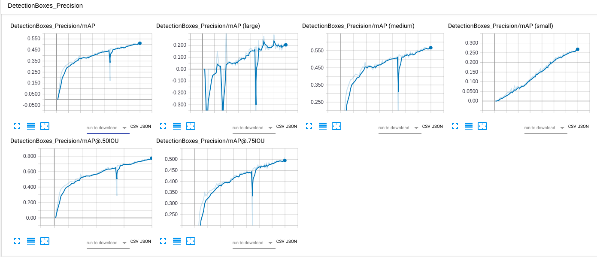
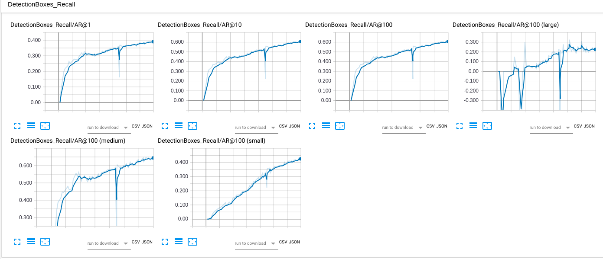
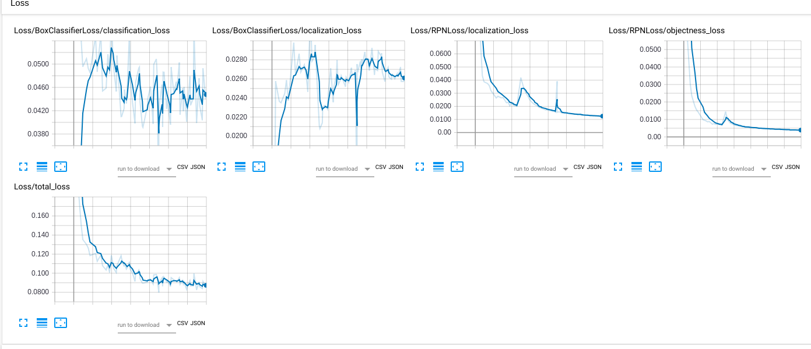

## Traffic Light Detection with Google Object Detection API

* Environment:
  - Python 3.6
  - Tensorflow 1.10.0
  - CUDA 9.0

* Dataset
  - LISA traffic light dataset

* pre-trained Model
  - Faster_RCNN_inception_v2_coco

---

## Pre-procession  

The pre-processing function, record_generator.py, generates the train/valid tfrecords and the pbtxt for object detection API. Below are the snippets of the function.

By passing the record file locations/names to the fuuction, one can get the recorrds. 

E.g. `python record_generator.py --train_path = './train.record --eval_path='./valid.record`

### Dictionary & pbtxt


```python
# The annotation dictionary for tf records and for pbtxt.
annotation_dict = {"go":1, "warning":2, "stop":3, "goLeft":4, "warningLeft":5, "stopLeft":6, "goForward":7}

    # Label_map generation 
    # Exporting the label_map.pbtxt with the dictionary previous generated.
    # Uncomment if needed

    with open ("PATH_TO_PBTXT/label_map.pbtxt", 'w') as file:
        for key in annotation_dict.keys():
            file.write("item {\n  id: %i\n" %(annotation_dict[key]+1))
            file.write("  name: '%s'\n}\n\n" %key)
    
```

### Train/valid ratio


```python
DATA_PATH = 'TOP_LEVEL_FOLDER'
TRAIN_PATH ='TRAINING_folder'  # path to dayTrain
TRAIN_RATIO = 0.7
```

### Features
Since there are multiple rows showing different bounding boxes of one file, a class for features of a file should work better especially when doing train_valid_split


```python
class single_record:
    '''
    A class for the tf_example protos.
    The image data is not loaded and the values are not featurized
    '''

    def __init__(self):
        self.xmins = []
        self.xmaxs = []
        self.ymins = []
        self.ymaxs = []
        self.classes_text = []
        self.classes = []
        # self.encoded_image_data = None
        self.height = 0
        self.width = 0
        self.filename = None

```


```python
def record_generator(records, writer):
    '''
    Create tf records from tf_example prototypes.
    
    Param :
        records - a list of tf_example protos (class single_record)
        writer - the corresponding tf.writer mapped with the flags
    
    Return :
        None but creating two tfrecords file
    '''
    image_format ='png'.encode()

    for record in records:
    # record = records[0]
        with tf.gfile.GFile(record.filename, 'rb') as fid:
            encoded_image_data = fid.read()
        # print("encode ok")

        filename = record.filename.encode()
        # print("filename ok", filename)
        tf_example = tf.train.Example(features=tf.train.Features(feature={
            'image/height': dataset_util.int64_feature(record.height),
            'image/width': dataset_util.int64_feature(record.width),
            'image/filename': dataset_util.bytes_feature(filename),
            'image/source_id': dataset_util.bytes_feature(filename),
            'image/encoded': dataset_util.bytes_feature(encoded_image_data),
            'image/format': dataset_util.bytes_feature(image_format),
            'image/object/bbox/xmin': dataset_util.float_list_feature(record.xmins),
            'image/object/bbox/xmax': dataset_util.float_list_feature(record.xmaxs),
            'image/object/bbox/ymin': dataset_util.float_list_feature(record.ymins),
            'image/object/bbox/ymax': dataset_util.float_list_feature(record.ymaxs),
            'image/object/class/text': dataset_util.bytes_list_feature(record.classes_text),
            'image/object/class/label': dataset_util.int64_list_feature(record.classes),
            }))
    # print("tf_example ok")
        writer.write(tf_example.SerializeToString())
    writer.close()
```

## Config

### Model

In the model section, I chose not to resize the input images and to keep the anchor size. For smaller objects, like the traffic light bulbs, I would change the anchor to 64x64. As for the max detections per class and total detections, 10 is pretty enough for most cases.

* fixed_shape_resizer
    - height:960
    - width: 1280
* grid_anchor_generator
    - height:128
    - width: 128
* max_detections_per_class: 10
* max_total_detections: 10

### Train_config

The initial learning rate is set at 0.00002. It is lower that the default value but I get the chance to see if something like overfitting showing during the training.

* initial_learning_rate: 0.00002
* from_detection_checkpoint: true





* The dipping in the middle of the training is due to wrong dataset imported after break/resume

## Result

Here I took three youtube driving videos of three different cities (Chicago, NYC and SF), made annotated version of them and took some screenshots showing below. If interested, the links to the annotated videos is also attached for references.

### NYC


### Chicago


### SF


